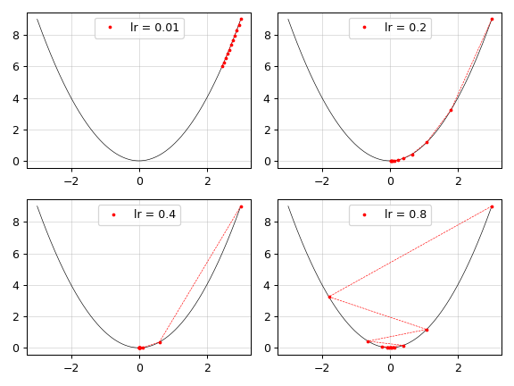

# PyDualNumber

This project provides a basic implementation of dual numbers in Python with an example application of dual numbers for automatic differentiation. Possibly interesting for educational purposes.

**Work in progress.**

## Dual Numbers

The [dual numbers system](https://en.wikipedia.org/wiki/Dual_number) was introduced 1873 by the English mathematician [William Clifford](https://en.wikipedia.org/wiki/William_Kingdon_Clifford).

Dual numbers are of the form $x = a + b \epsilon$, where $a$ and $b$ are real numbers, and $\epsilon$ for which the property $\epsilon^2 = 0$ holds.


### Arithmetic Operations

The arithmetic operations for dual numbers are defined as follows.

| Operation | |
|---|---|
| Addition | $$(a + b \epsilon) + (c + d \epsilon) = (a + c) + (b + d) \epsilon$$ |
| Subtraction  | $$(a + b \epsilon) - (c + d \epsilon) = (a - c) + (b - d) \epsilon$$ |
| Multiplication | $$(a + b \epsilon) (c + d \epsilon) = a c + (a d + b c) \epsilon$$ |
| Division | $$\frac{a + b \epsilon}{c + d \epsilon} = \frac{a}{c} + \frac{b c - a d}{c^2} \epsilon$$ |


### Differentiation

Any real function can be extended to the dual numbers.To see this, we can employ the Taylor series given by:

$$f(x) = \sum_{k=0}^{\infty}\frac{f^{(k)}(x_0)}{k!}(x-x_0)^k$$

As we are interested in the behavior of a real function extendend by the dual numbers, we set $x=x_0+b\epsilon$ with $x_0=a$.

$$f(x) = \sum_{k=0}^{\infty}\frac{f^{(k)}(a)}{k!}(b\epsilon)^k$$

By the definition of $\epsilon$, all terms with $k>1$ disappear. Thus, we end up with

$$f(a+b\epsilon) = f(a) + f'(a)b\epsilon$$

This property is especially interesting for [automatic differentiation](https://en.wikipedia.org/wiki/Automatic_differentiation).

We can use this expression to extend functions such as hyperbolic or power functions to the dual numbers.

| $f(x)$ | $f(a+b\epsilon)$ |
|---|---|
| $\sin(x)$ | $\sin(a) + \cos(a)b\epsilon$ |
| $\cos(x)$ | $\cos(a) - \sin(a)b\epsilon$ |
| $\tanh(x)$ | $\tanh(a) + (1 - \tanh(a)^ 2)b\epsilon$ |
| $\exp(x)$ | $\exp(a) + \exp(a)b\epsilon$ |
| $\ln(x)$ | $\ln(a) + \frac{1}{a}b\epsilon$ |


### Rectified Liner Unit Activation Function (ReLU)

We can also extend activation functions such as $\text{ReLU}(x)$ for dual numbers. The definition for the $\text{ReLU}$ activation functions is given by

$$
\text{ReLU}(x) =
    \begin{cases}
        x & x > 0\\
        0 & \text{else}
    \end{cases}       
$$

and thus it follows for dual numbers

$$
\text{ReLU}(a+b\epsilon) =
    \begin{cases}
        a + 1b\epsilon & x > 0\\
        0 & \text{else}
    \end{cases}       
$$


### Exponentiation

We ca use the expressoin $f(a+b\epsilon) = f(a) + f'(a)b\epsilon$ also for slightly more complex expresssions such as $f(x, y) = x^y$ where both $x$ and $y$ are dual numbers.

For this to work we use the Taylor series for two variables up to the first order:

$$f(x, y) = f(x_0, y_0) + \partial_x f(x_0, y_0)(x-x_0) + \partial_y f(x_0, y_0)(y-y_0) + \cdots$$

Again we won't consider higher order terms as these become zero since $\epsilon^2 = 0$. Applying the same logic as above using $x=a+b\epsilon$ and $y=c+d\epsilon$ with $x_0=a$ and $y_0=c$ we derive an expression for the extension of a function of two variables for dual numbers:

$$f(a+b\epsilon, c+d\epsilon) = f(a, c) + \partial_x f(a, c)b\epsilon + \partial_y f(a, c)d\epsilon$$

Now we have everything to extend $f(x, y) = x^y$ to dual numbers:

$$\begin{aligned}
f(a+b\epsilon, c+d\epsilon) &= a^c + (ca^{c-1}b + a^c\ln(a)d)\epsilon \\ &= a^c + a^c(\frac{b}{a}c + \ln(a)d)\epsilon
\end{aligned}$$

Thus, for the actual implementation in Python, the following cases for exponentiation involving dual numbers are of interest.

| $f(x, y)$ | $f(a+b\epsilon, c+d\epsilon)$ |
|---|---|
| $x^y$ | $a^c + a^c(\frac{b}{a}c + \ln(a)d)\epsilon$ |
| $x^c$ | $a^c + a^{c-1}bc\epsilon$ |
| $a^y$ | $a^c + a^c\ln(a)d\epsilon$ |

As you can see, this expression can also be used to compute quantities where $x$ or $y$ are just real numbers.


## Examples


### Example usage

```python
from dualnumber import Dual

d1 = Dual(1, 2)
d2 = Dual(3, 4)
d3 = d1 + d2
d4 = d3 - d2
d5 = d4 * d3
d6 = d5 / d4
d7 = d6.sin()
d8 = d7.cos()
d9 = d9.tanh()
d10 = d9.ln()
d11 = d10.exp()
d12 = d11**d10
d12 = d11.relu()
```


### Automatic Differentiation with Dual Numbers

Dual numbers are great for automatic differentiation. Here is a toy example showing gradient descent for $f(x)=x^2$ and different step sizes with dual numbers.



Run the example

```bash
cd dual_number
python -m examples.gradient_descent
```

## Installation

Run the following command to install this package in your environment:

```bash
pip install .
```


## Tests

Run the tests by executing:

```bash
cd dual_number
pytest dual_number
```

## Clean Code

Some good practices for software developement in Python.


### Checking type consistency

Install static type checker `mypy`:

```bash
pip install mypy
```

Ignore false positives by adding a marker as a comment:

```python
a = "bla"   # type: ignore
```

Check type consistency by running:

```bash
mypy dual_number
```

### Checking Code Structure

Install `pylint` to check for generic code structure:

```bash
pip install pylint
```

Check code structure by running:

```bash
pylint dual_number
```

Or run `pylint` with a customiced pylintrc file:

```bash
pylint --rcfile dual_number/pylintrc dual_number
```


### Automatic Formatting

This project uses `flake8` and `black` for automatic formatting.

Install `flake8` for full flexibility and configurability and `black` for uncompromising and deterministic code formatting:

```bash
pip install flake8
pip install black
```

Run tools for automatic formatting:

```bash
flake8 dual_number
black --check dual_number
```

Remove the `--check` flag to perform automatic formatting changes.


### Automatic Checks

Instead of running all checks manually we can make use of Makefiles to run them all automatically. Run the following command in the root folder:

```bash
cd dual_number
make check
```

This check will automatically fail if at least one check fails. To run all checks ignoring errors by running:

```bash
cd dual_number
make --ignore-errors check  # or: make -i check
```


## Citation

If you find this content useful, please cite the following:

```bibtex
@misc{KaiFischer2022pdn,
  author = {Fischer, Kai},
  title = {PyDualNumber},
  year = {2022},
  publisher = {GitHub},
  journal = {GitHub repository},
  howpublished = {\url{https://github.com/kaifabi/python-dual-number}},
}
```

## Licence

MIT


# TODOs

- Add documentation.
